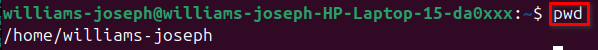

# Basic Linux Commands
This repository features a set of essential Linux commands frequently used in the command line interface (CLI). These commands are fundamental for navigating and managing files and directories within a Linux environment.

##  The `sudo` Command
In Linux, certain actions require elevated permissions, such as creating files in restricted directories or modifying crucial system settings. This is where the `sudo` command comes in. Short for "superuser do," `sudo` allows you to temporarily execute commands with the privileges of another user, usually the superuser or "root."

#### How sudo Works
---

* When attempting to create a directory in a restricted area, you’ll encounter a "permission denied" error.

* To create a directory in such a protected area, simply prefix the command with `sudo` to run it with the necessary privileges. To confirm that the directory was successfully created, you can use the `ls` command to list the contents of the directory.

## The `pwd` command 
The `pwd` command stands for "print working directory." It is used to show the current directory you're in within the command line interface. This helps you understand where you are in the file system.

#### How pwd Works
---

To use the `pwd` command, just type `pwd` in the terminal and hit Enter. It will display the full path of the directory you're currently located in.

## The `cd` Command

The `cd` command, which stands for "change directory," allows you to move between different directories within the file system. You can use it to navigate to a specific directory or return to the previous one.

#### How `cd` Works
---

- To navigate to a specific directory (such as the root directory "/"), use the command `sudo cd` followed by the path to the directory you wish to access.

- If you want to list the files and directories within the current directory, you can use the `ls` command.

## Side Hustle Task 1

- Created a directory named `photos` inside the `/usr` directory.

- Navigated into the `photos` directory. Created 3 random directories within the photos directory. Displayed the newly created directories in the terminal usin `ls`.

- Navigated into one of the newly created directories. Showing the full path of the current location.

## The `ls` Command

The `ls` command is one of the most commonly used commands in Linux/Unix-based systems. It allows you to list the contents of a directory, whether files, directories, or other types of items. By default, it shows the files and directories within the current working directory, but you can also specify a different directory to list its contents.

#### How the `ls` Command Works:
---

- **Basic Usage:** Simply typing `ls` in the terminal will display the names of files and subdirectories in the current directory.

- **Listing a Specific Directory:**
You can also provide a path to list contents from a specific directory. 

## The `cat` Command
The `cat` command, short for concatenate, is one of the most frequently used commands in Linux and Unix-like operating systems. It is primarily used to display the contents of files, combine multiple files, and create new files. It outputs the content of a file to the terminal, or it can concatenate (join) files together.

#### How the `cat` Command Works:
---
- **Displaying the Contents of a File:**
To display the content of a file in the terminal, simply type cat followed by the name of the file (including its extension, like .txt or .log)

- **Concatenating Multiple Files:**
The `cat` command can be used to concatenate (combine) the contents of multiple files into a single output.

- **Displaying Line Numbers:** If you want to display the content of a file with line numbers, you can use `-n`

## The `cp` Command
The `cp` command is used to copy files and directories from one location to another in Unix-like operating systems. It's one of the basic but essential file management commands. You can copy files, directories, or entire directory structures to new locations, and there are several options to control how it behaves.

#### How the `cp` Command Works
---
- **Copying a Single File:**
To copy a single file from one location to another, use the `cp` command followed by the source file and the destination directory or file.

- **Copying Multiple Files to a Directory:**
You can copy multiple files to a specific directory by listing the files followed by the destination directory.

- **Copying File Content to Another File:**
You can also copy the content from one file to another file. In this case, the source and destination are both files.

- **Copying Directories and Their Contents:**
To copy a directory and its contents (subdirectories and files), you need to use the `-R` (recursive) option. This tells `cp` to copy the directory and everything inside it.

## The `mv` Command
The `mv` (move) command in Linux is used to move or rename files and directories. Unlike the `cp` command, which creates copies, `mv` actually relocates or renames the files without creating duplicates. It is a versatile tool for file management.

#### How the `mv` Command Works
---
- **Moving a File:**
To move a file from one location to another, you use the `mv` command followed by the source file and the destination directory.

- **Renaming a File:**
The `mv` command can also be used to rename a file. To rename, specify the current file name and the new file name.

## The `rm` Command
The `rm` command is used in Linux to delete files and directories. It permanently removes the specified files or directories.

#### How the `rm` Command Works
---
- To delete a single file, use the command followed by the file name.

- To remove multiple files, list the file names separated by spaces.

## The `touch` Command

The `touch` command is used in Linux to create empty files or update the timestamps of existing files.

#### How `touch` works
---

To create an empty file, use the touch command followed by the desired file name.

## The `find` Command
The `find` command is used in Linux to search for files and directories within a specified location, based on different search criteria such as name, type, size, and more.

#### How the `find` Command Works
---

To find a file by name, use the `find` command followed by the directory to search in and the `-name` option with the file name.

## Conclusion

This repository provides a comprehensive overview of essential Linux commands that are frequently used in the command line interface (CLI). These commands form the foundation for navigating and managing files and directories in a Linux environment. From basic operations like creating files with `touch` and searching for files with `find`, to more advanced tasks such as moving and copying files using `mv` and `cp`, these commands are crucial for efficient file system management.

By understanding and mastering these commands, users can perform a wide range of tasks, from basic navigation with ``pwd` and `cd`, to modifying system files with elevated permissions using sudo. The knowledge of these commands will greatly improve your command line proficiency and your ability to interact with Linux-based systems.